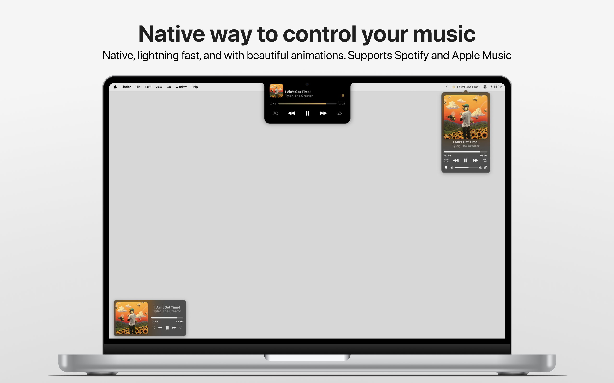

  
  <h3 align="center">Tuneful</h3>
  

    Tuneful is a native macOS playback control app for Spotify and Apple Music
  

  

## About
This is my personal fork of Tuneful, a native macOS playback control app for Spotify and Apple Music. This version is maintained and customized for my own use.

## Features
- Notch player inspired by Dynamic Island
- Fluid and native UI with smooth animations
- Mini player and menu bar player types
- Trackpad integration with swipe gestures
- Customization options
- Bug fixes and performance improvements

## Feedback
If you encounter any issues or have suggestions for improvement, please open an issue.
